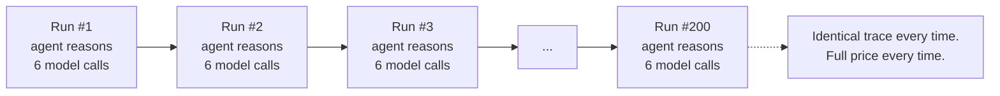
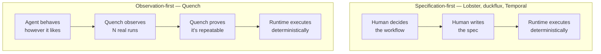
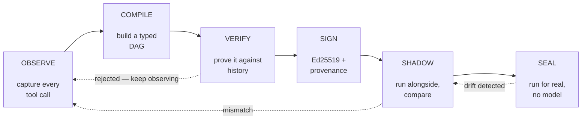
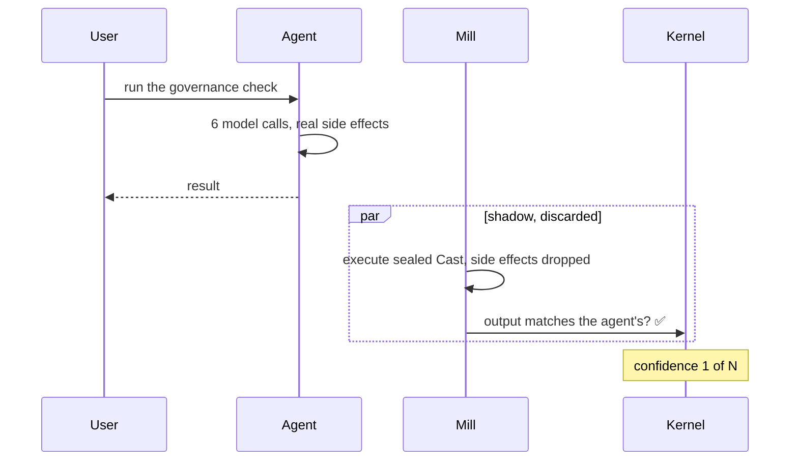
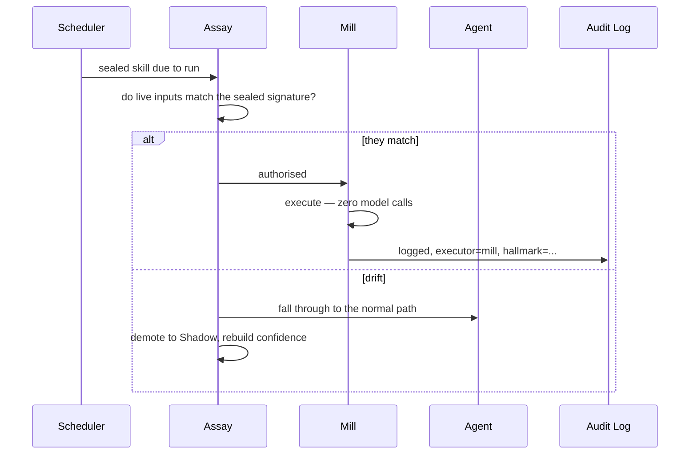
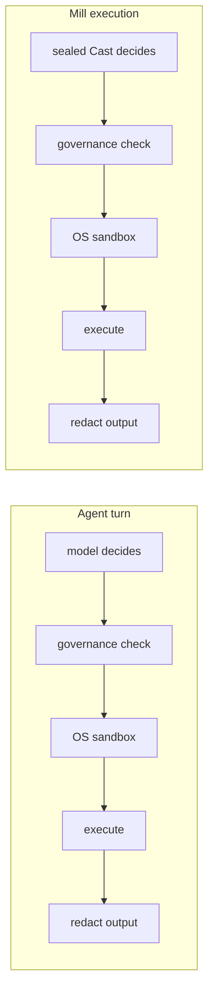
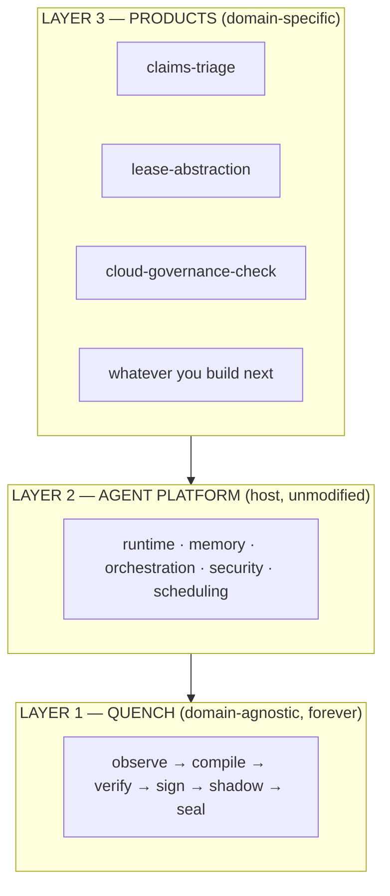
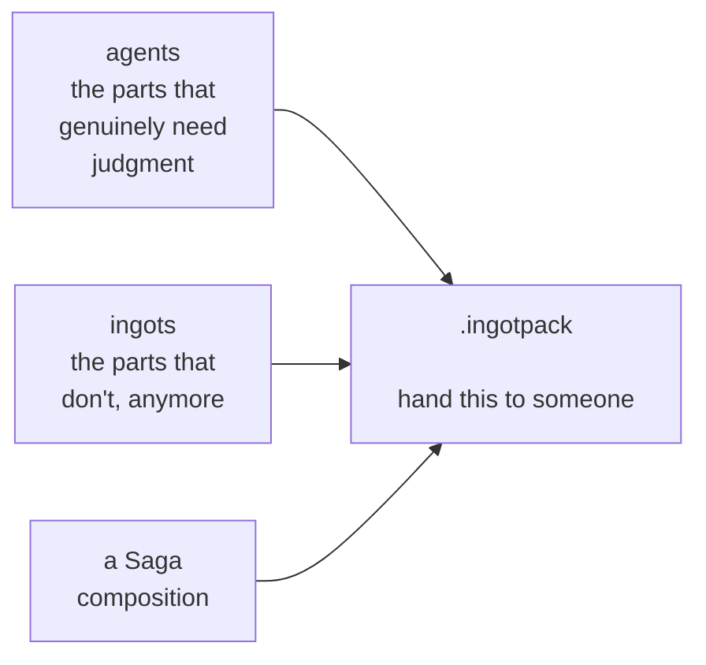
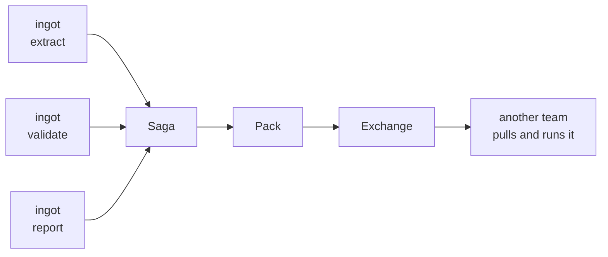

# Why Quench Exists

*The case for the product, in plain language, with worked examples.*

This document is the source material for presentations, pitches, and onboarding.
It assumes no prior knowledge of Quench and very little about agent frameworks.
For the technical architecture see [`architecture/overview.md`](architecture/overview.md);
for what we verified against a live install see [`adr/0000-crew-seam-verification.md`](adr/0000-crew-seam-verification.md).

---

## Contents

1. [The one-sentence version](#1-the-one-sentence-version)
2. [The problem](#2-the-problem)
3. [A worked example of the waste](#3-a-worked-example-of-the-waste)
4. [Why nothing else solves this](#4-why-nothing-else-solves-this)
5. [The insight](#5-the-insight)
6. [How Quench works](#6-how-quench-works)
7. [Following one skill all the way through](#7-following-one-skill-all-the-way-through)
8. [Why sealing is safe](#8-why-sealing-is-safe)
9. [What you actually get](#9-what-you-actually-get)
10. [Building products on Quench](#10-building-products-on-quench)
11. [Where this goes](#11-where-this-goes)
12. [Objections worth taking seriously](#12-objections-worth-taking-seriously)
13. [Slide-ready summary](#13-slide-ready-summary)

---

## 1. The one-sentence version

> **Most of this category makes deterministic execution something you
> *author*. Quench makes it something you *earn* — and turns the result into
> a portable, signed, policy-verified artifact.**

Two recent systems also observe rather than author — Microsoft's Progressive
Crystallization and the LOOP Skill Engine. Neither produces a transferable
artifact, neither checks output purity, and both are welded to a single
runtime. See [`COMPETITIVE-LANDSCAPE.md`](COMPETITIVE-LANDSCAPE.md) before
presenting any of this.

---

## 2. The problem

Modern agent workspaces learn. [Kiro Crew](https://github.com/kirodotdev/KiroCrew)
watches you work, notices you've done something several times, and synthesises it
into a named, editable **skill** — a Markdown file describing the workflow.

That is genuinely useful. But notice what a skill *is*: **a prompt, not a program.**

So the 200th time you run it, the agent reads the skill, thinks about it, decides
which tool to call, calls it, reads the result, thinks again, calls the next tool.
Every single step is a model call. Exactly as it was the first time — even though
the execution trace has been byte-for-byte identical for three months.



The system is a **learning** system. It has no **compiling** step.

That's the gap. Not a bug in Crew — a missing layer. Crew is a genuinely good
learning loop, and learning loops don't naturally grow compilers.

### The analogy that makes it click

An interpreter runs your code line by line, every time. A JIT compiler notices
that a particular path has run thousands of times, proves it's stable, and
compiles it to native code — while keeping every safety guarantee the interpreter
had, and falling back the instant an assumption breaks.

Agent runtimes today are interpreters with no JIT.

**Quench is the JIT.**

---

## 3. A worked example of the waste

Take a real, unglamorous workflow: an hourly cloud governance check.

> Pull a resource's configuration → check it against a fixed policy set →
> report compliant or non-compliant → log the finding.

| | |
|---|---|
| Runs per month | **720** (hourly) |
| Model calls per run | **~6** (one per reasoning step) |
| Model calls per month | **~4,320** |
| Times the execution trace varied in 90 days | **0** |

Four thousand model calls a month to re-derive a decision that has not changed
once. The agent isn't thinking — it's *re-reading its own notes and pretending to
think*, at full price, forever.

And the cost isn't only tokens:

- **Latency.** Six sequential model round-trips where a compiled artifact takes
  milliseconds.
- **Variance.** A model can always answer slightly differently. On a workflow
  that should be deterministic, that variance is pure risk.
- **Audit noise.** Every run produces reasoning traces a compliance reviewer has
  to read, for a decision that was settled months ago.

This is the exact case Quench exists for. Not the hard, judgment-heavy work —
the work that *stopped* being judgment-heavy and nobody noticed.

---

## 4. Where this sits in a real field

Deterministic agent execution is an active field and moving fast. Be precise
about who does what — a vague answer here loses technical audiences, and a
wrong one loses them permanently. Full survey:
[`COMPETITIVE-LANDSCAPE.md`](COMPETITIVE-LANDSCAPE.md).

### The authored camp — you write the deterministic spec

| Tool | What it does | Why it isn't Quench |
|---|---|---|
| **Lobster** (OpenClaw) | Typed pipeline runtime. You hand-write a `.lobster` YAML with steps and approval gates. Deterministic because a human wrote a deterministic spec. | Requires you to already know the workflow shape and write it down. |
| **duckflux / dot-agent** | Declarative DSLs for defining agent workflows up front. | Specification-first, not observation-first. |
| **Conductor** (Microsoft) | Multi-agent workflows in YAML; deterministic routing, zero-token orchestration layer. | Same — authored. |

Each is excellent at *"here's the workflow I already know I want."*

### The generated camp — an LLM writes the code once

| Tool | What it does | Why it isn't Quench |
|---|---|---|
| **Compiled AI** (XY.AI Labs) | LLM generates narrow business logic inside pre-validated templates; deploys as static code. 96% task completion, zero execution tokens, 57× token reduction. | Generation-first. The model is asked to write the workflow, not observed performing it. |

### The observed camp — behaviour is watched, then promoted on evidence

**This is our camp, and it is not empty.** Say so first, before anyone else does.

| System | What it does | Where Quench differs |
|---|---|---|
| **Progressive Crystallization** (Microsoft Azure Networking, [arXiv 2607.07052](https://arxiv.org/abs/2607.07052)) | Extracts successful behaviour from traces, promotes on evidence (≥10 runs, ≥90% identical action sequence, zero safety violations), demotes automatically on drift. **>70% cost reduction in production; 0→45% deterministic over eight months.** | Internal Azure infrastructure for one domain. No portable artifact, no signing or provenance, no cross-runtime capture. Its promotion test checks *control flow only* — see §8. |
| **LOOP Skill Engine** ([arXiv 2605.14237](https://arxiv.org/abs/2605.14237)) | Records a tool trajectory on first run, extracts a parameterised branch-free template, replays with the LLM bypassed. **93.3–99.98% token reduction, 8.7× faster.** | **One-shot** — record once, replay thereafter. Quench requires convergence across N traces, a purity check, and a Shadow Mode record against the live agent. One-shot cannot distinguish a stable workflow from one you happened to see once. |

### The honest framing

Someone has already proven this works in production, at scale, with numbers
better than any we can currently show. **That is an asset.** It means the
category is validated and the argument shifts from *"will this work?"* to
*"whose implementation do you want?"*

Ours is the one that produces a **portable, signed, policy-verified artifact**
any runtime can create and any team can inspect, revoke or share.



Quench asks a different question — one the *authored* tools cannot answer,
and one two recent observation-first systems also ask (§4.1):

> **Which of my agent's ad-hoc, LLM-driven behaviours have quietly become a
> workflow, without anyone writing it down?**

You cannot answer that by authoring a spec. You can only answer it by watching.

---

## 5. The insight

Two things are true at once, and holding both is the whole idea:

1. **You cannot know in advance which agent behaviours are deterministic.** If
   you could, you'd have written a script instead of hiring an agent.
2. **After the fact, you can prove it** — because the agent's own execution
   history is right there, recorded, in the audit trail the platform already
   keeps.

So determinism becomes an **empirical property discovered from evidence**, not a
design-time assertion. That reframing is the foundation — though not, on its own,
the defensible part: two other systems reached it independently (§4). What
follows from it, and what nobody else has built, is a *transferable* artifact
carrying its own proof.

It also means Quench's claims are falsifiable in a way authored-workflow tools'
claims are not. A `.lobster` file says "this is deterministic" because a human
asserted it. An `.ingot` says "this is deterministic" and can show you the
fifty traces it was proven against.

---

## 6. How Quench works

Six stages. A skill moves through them on its own, and can move backwards at any
point.



**1 — Observe.** A hook records every tool call: what ran, with what input,
producing what output, grouped by session. No change to the agent. It doesn't
know it's being watched, and nothing it does is affected.

**2 — Compile (Cast).** After enough runs with no branching, build a typed DAG
of the steps. This is cheap and implies no trust whatsoever.

**3 — Verify (Assay).** Check the DAG against *every* historical trace. Also
re-run the platform's own security governance over every step — a step the
platform would refuse to run gets rejected here, at compile time.

**4 — Sign (Hallmark).** Ed25519-sign it into a portable `.ingot` with a
provenance record: who verified it, against how many traces, under which policy,
when.

**5 — Shadow.** Run the compiled artifact *alongside* the real agent, discarding
all side effects, comparing outputs. This is mandatory. There is no skip-the-line
path, not even from the CLI.

**6 — Seal.** The artifact answers. Every single run still re-checks live inputs
against the sealed signature first.

### The vocabulary

| Term | What it is |
|---|---|
| **Cast** | The typed IR compiled from traces |
| **Assay** | The verifier — at seal time, and again on every run |
| **Hallmark** | The signature and provenance record |
| **Ingot** | The sealed, signed, portable artifact |
| **Vault** | Where ingots are stored |
| **Mill** | The executor — no model in the loop |
| **Kernel** | The Shadow/Sealed state machine |
| **Saga** | Chains several ingots into one workflow |
| **Pack** | A distributable bundle of ingots |
| **Exchange** | The registry for sharing Packs |

---

## 7. Following one skill all the way through

Concrete, start to finish. The workflow: **check an S3 bucket's encryption
settings against policy and log the finding.**

### Week 1 — Observing

The agent does the work the normal way. Six model calls per run. Quench records:

```json
{
  "hook_event_name": "postToolUse",
  "session_id": "f0051f6c-...",
  "tool_name": "read",
  "tool_input": {
    "__tool_use_purpose": "Read bucket encryption config",
    "operations": [{"mode": "Line", "path": "/configs/bucket-a.json"}]
  },
  "tool_response": {"items": [{"Text": "{\"encryption\": \"AES256\"}"}]}
}
```

Note what's here: the tool, the *structured* input, the actual output, and the
agent's own stated intent. That last field is free documentation.

### Week 2 — A candidate forms

Five runs in, the traces converge. Same steps, same input *shapes* — different
bucket names, but that's a value, not a shape.

```
$ quench cast
Cast a3a46702631d33fb  (4 steps, 5 traces)
    0  read     Read bucket encryption config
    1  read     Load policy definitions
    2  shell    Compare config against policy
    3  write    Append finding to the log
```

Before this, the answer was actionable rather than silent:

```
$ quench cast
Not a candidate: needs 5 clean traces to form a candidate, has 3;
2 more required
```

That phrasing is deliberate — an agent or a human can act on it directly.

### Week 2 — Verification

Assay checks two separate things:

- **No branching.** Do all five traces have the same shape? ✅
- **Purity.** Does any step return output that varies for reasons unrelated to
  its input? Timestamps, UUIDs, process IDs, memory addresses?

That second check is not theoretical. The very first trace we ever captured
contained this:

```
-rw-r--r-- 1 1000 1000 99 Sep 09 14:15 .../quench-test.txt
```

A directory listing with an mtime in it. Perfectly non-branching — and it returns
different bytes every single run. Sealing it would produce an artifact that
silently replays yesterday's timestamp forever.

**Non-branching is a property of control flow. Determinism also requires purity
of values.** Both, or no seal.

### Week 3 — Shadow Mode

The agent keeps doing the work for real. Mill runs the sealed candidate in
parallel and throws its side effects away. Only the comparison is kept.



Nothing is promoted on the strength of internal consistency. Promotion requires a
track record of matching the agent's *real* behaviour.

### Week 4 — Sealed

Confidence threshold reached. Now:



**Zero model calls.** And if anything about the world changed — a new field, a
different response shape, an unexpected path — it silently falls back to the
agent and starts re-earning trust.

---

## 8. Why sealing is safe

The obvious objection: *you've removed the intelligence from the loop; isn't
that dangerous?*

Four answers, in order of importance.

### Sealing is a cache, not a promise

Sealed Mode is never a one-way door. Every execution re-checks live inputs
against the sealed signature. A single mismatch demotes the skill immediately.
The system is designed to lose confidence easily and regain it slowly.

### Shadow Mode is mandatory

Nothing reaches Sealed Mode without a record of producing the *same output as the
real agent* across repeated live runs. Not self-consistency — agreement with the
thing it's replacing.

### Security is not bypassed, only the model call is

This is the most important rule in the project:



Only the first box differs. Mill passes through the *identical* governance check,
the *identical* OS sandbox, and the *identical* output redaction. And Assay
re-applies the platform's governance policy at compile time too, so a Cast
containing a step the platform would refuse is rejected before it is ever signed.

**The test:** if a reviewer cannot tell from the audit log alone whether a step
ran through Mill or the model — except for one clearly labelled field — the
security model is implemented correctly.

### Scope is deliberately narrow

Version 1 seals **linear, non-branching workflows only**. Anything with
conditional logic in its history is left alone. That is a hard boundary, not a
limitation to engineer around. Most of the value is in the boring repetitive
work, and the boring repetitive work is exactly what's linear.

---

## 9. What you actually get

Honest numbers, stated as conditions rather than a headline.

| Workflow type | Mechanism | Model calls |
|---|---|---|
| **Scheduled** (cron, monitoring, periodic checks) | Backend invokes Mill directly — no agent, no turn | **Zero** |
| **Interactive** (user-triggered) | Mill exposed as a single callable tool | **One turn instead of N** |
| **Not yet sealed** | Normal agent path, untouched | Unchanged |
| **Drifted** | Automatic fallback to the agent | Unchanged |

Two things we will not claim:

- **We will not say "zero tokens" unqualified.** On interactive workflows the
  host platform gives plugins no way to answer in place of a turn. We collapse N
  round-trips into one; we don't eliminate the turn. Saying otherwise wouldn't
  survive a reviewer who reads the platform docs.
- **We will not publish projected savings.** The number that goes in any
  write-up is measured from real before/after model-call counts. If we can't
  measure it, we don't claim it.

Beyond cost:

- **Latency** — milliseconds instead of sequential model round-trips.
- **Determinism** — the same input produces the same output, provably.
- **Auditability** — an `.ingot` is inspectable. You can read exactly what will
  run, and the provenance record showing what it was proven against.
- **Portability** — an `.ingot` is a file. It moves between machines and teams.

---

## 10. Building products on Quench

This is the part that matters if you're adding to it.

### Three layers. Never confuse them.



**Your products live at Layer 3. They *are* multi-agent systems. Quench is what
makes them cheap.**

Quench itself is not a multi-agent system and not an orchestrator. It operates on
one behaviour at a time, one layer below orchestration. It never decides which
agent runs or in what order.

### The rule

> **Quench must never contain domain logic.**

The moment the compiler imports something that knows what an insurance claim is,
we no longer have a kernel — we have one company's internal tool with a compiler
bolted on.

### Adding a new agent or product

Four files, in `showcase/<name>/` or your own repository:

| File | Purpose |
|---|---|
| `agent.json` | The agent config |
| `skill.md` | The workflow, in the platform's own skill format |
| `synthetic_data/` | Generated data. **Never real client data. Ever.** |
| `run_demo.sh` | Drives enough repeated runs to accumulate history |

And **zero lines** in `cast/`, `assay/`, `vault/`, `kernel/`, `saga/`, `mill/`,
`pack/` or `exchange/`.

### The falsification test

If a new domain *forces* a kernel change, that is not a feature request from the
domain. It is proof the Cast IR is underspecified.

**Fix the IR, not the special case.**

This single rule decides whether Quench stays a product or degenerates into a
pile of accumulated exceptions. It is worth being strict about, including when
it's inconvenient.

### What a shipped product looks like



*"Install this pack and most of the workflow costs nothing."*

---

## 11. Where this goes

### Portability is the real prize

Trace capture reads a hook contract — tool name, tool input, tool response, on
stdin — that Kiro CLI, Claude Code and OpenClaw all expose in near-identical
shape. The `TraceSource` port isn't aspirational; it generalises almost for free.

> **Quench is a determinism compiler for any agent runtime that emits tool hooks.
> Kiro Crew is simply the first host.**

That's the difference between shipping a plugin and defining a category.

### Composition, then distribution



Once workflows are files, they're shareable. A team seals a workflow once; every
other team pulls it and runs it for free. That's a registry of *compiled
behaviour* — a genuinely new artifact type.

### The upstream contribution

Kiro Crew's maintainers documented, in their own architecture notes, that apps
cannot intervene in core flows and that the hook manager exposes no registration
path. That limitation is why interactive Sealed Mode collapses turns rather than
eliminating them.

Opening that seam upstream is on our roadmap. It converts the project's principal
limitation into its principal contribution — and it's the difference between
"I built a plugin" and "I extended the platform."

---

## 12. Objections worth taking seriously

**"Why not just write a script?"**
Because you didn't know it was scriptable. That's the entire point. The workflow
became deterministic gradually, through repetition, and nobody noticed the moment
it stopped needing judgment. Quench notices.

**"What if the workflow changes?"**
It falls back to the agent automatically, demotes itself, and starts re-earning
confidence. You lose the savings for that skill until it stabilises again. You
never get a wrong answer from a stale artifact.

**"Isn't this just caching?"**
Caching stores *results*. Quench compiles *behaviour* — it re-executes the real
steps with real side effects against live inputs. A cache would return last
week's answer; Mill does this week's work without re-deciding how.

**"How do I know what a sealed artifact will do?"**
Read it. An `.ingot` is an inspectable list of typed steps, each labelled with
the agent's own stated intent, plus a provenance record. That's a far stronger
guarantee than a prompt, which could produce anything.

**"What if the agent learned the workflow wrong?"**
Then Quench faithfully compiles a wrong workflow — and Shadow Mode compares it
against the agent, which is also wrong, and they agree. **Quench proves
repeatability, not correctness.** It is not a substitute for reviewing what your
agent does. It makes existing behaviour cheaper, not better.

**"Why only linear workflows?"**
Because that's what we can prove. Branching support is v2, gated on the linear
case being battle-tested. Shipping a narrow thing that works beats shipping a
broad thing that mostly works.

---

## 13. Slide-ready summary

**The problem**
Agent workspaces learn workflows into skills. A skill is a prompt, not a program.
The 200th identical run costs the same as the first.

**The insight**
You can't know in advance which behaviours are deterministic. After the fact you
can prove it — the evidence is already in the audit trail.

**The product**
Quench watches an agent, proves a behaviour is repeatable, compiles it into a
signed artifact, and runs it without a model — falling back the instant the world
stops matching.

**The differentiator**
Most of the field makes determinism something you author. Quench makes it
something you earn — and the only one that makes the result a portable,
signed, inspectable artifact.

**The trust model**
Shadow Mode is mandatory. Sealing is a cache, not a promise. Only the model call
is bypassed — never the security check.

**The honest numbers**
Zero model calls on scheduled workflows. One turn instead of N on interactive
ones. Measured, never projected.

**The scope**
Linear, non-branching workflows in v1. A hard boundary, not a limitation to
engineer around.

**Where it goes**
Any agent runtime that emits tool hooks. Kiro Crew is the first host, not the
only one.
