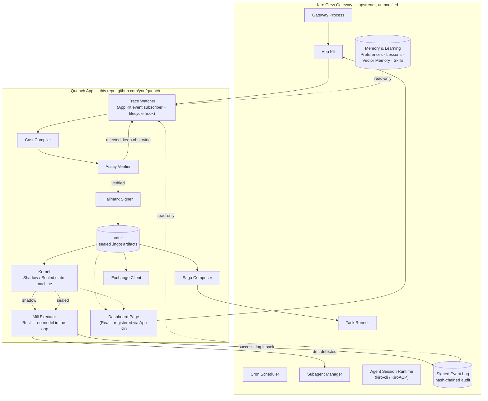
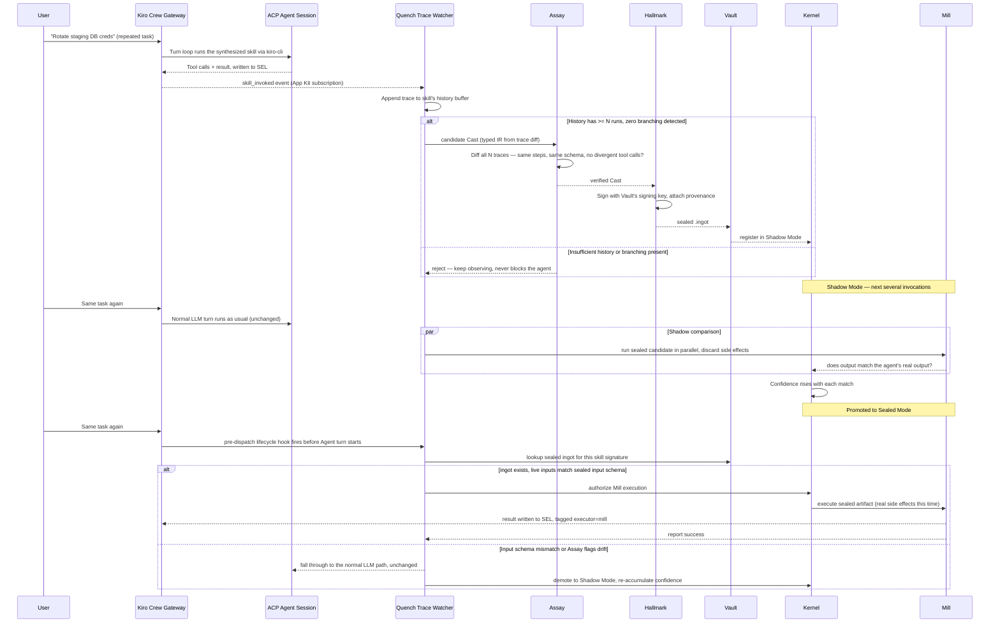
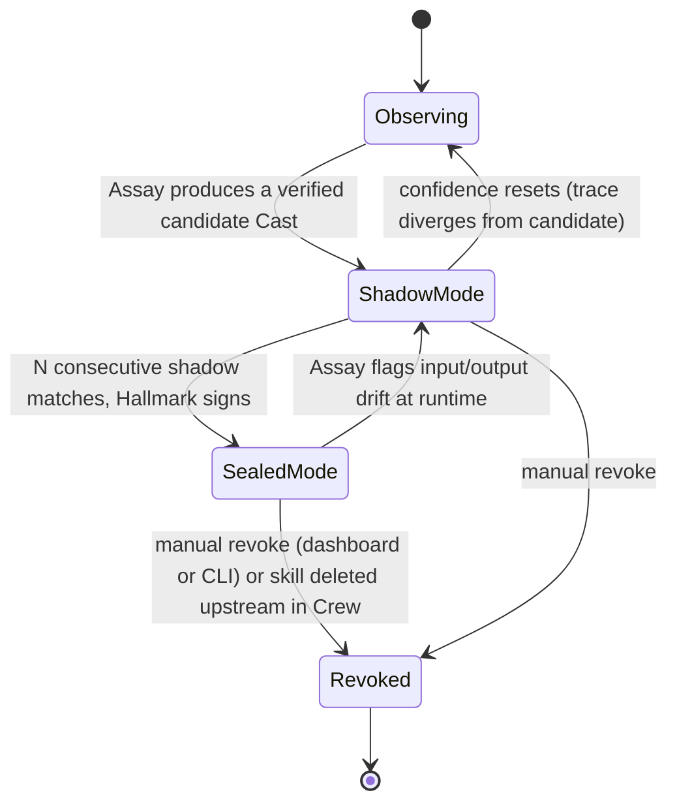
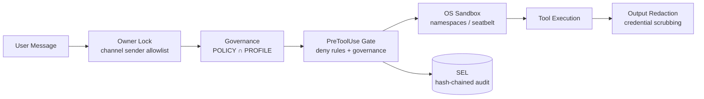
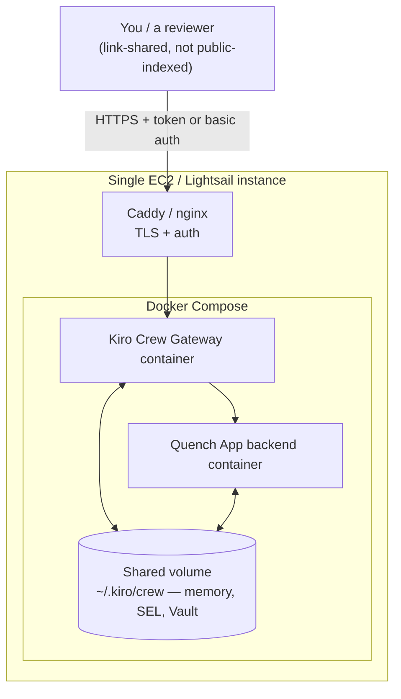

# Quench: A Deterministic Execution Kernel for Kiro Crew
### (compiles verified, repeated agent behavior into sealed `ingot` artifacts)
### Architecture & Build Brief v1.2 — Named, Positioned, Execution Edition

> **Purpose of this document**: a complete, self-contained brief for Claude Code to build the `quench` repository to a *concluded, running, measured* v1 — not a scaffold that stops at diagrams. It defines what Quench is, how it plugs into Kiro Crew without forking Crew itself, the directory layout, every component's responsibility and interface boundary, the data flow, the security model, three real domain showcase agents, a minimal cloud deployment, and a phased plan where **every later phase is gated on the previous one producing a real, measured result** — no phase starts on the strength of the previous phase's design alone. §17 ("Definition of Done") is the checklist that decides whether this is actually finished; treat it as the source of truth over any other section if they ever disagree.

---

## 1. Why This Exists

Kiro Crew (AWS, Apache-2.0, `github.com/kirodotdev/KiroCrew`) is a persistent, self-learning agent workspace. It already does three things relevant to us extremely well:

1. **It observes.** Every tool call, every turn, every approval is written to a hash-chained Signed Event Log (SEL). Repeated workflows get synthesized automatically into named, inspectable Markdown **skills**.
2. **It remembers.** A local-first memory system (Preferences, Projects, Daily History, Lessons, Vector Memory, Knowledge Library) means the agent doesn't re-derive context every session.
3. **It's extensible without forking.** The **App Kit** lets a separate git repo contribute agents, skills, a backend service, and dashboard UI pages to a running Gateway — installed by cloning, building, and registering, with no changes to Crew's own codebase.

What Crew does **not** do: once a skill is learned and has been run successfully fifty times, Crew still pays for an LLM turn to run it the fifty-first time. Every execution — however repetitive, however deterministic the historical trace — goes back through the model. That's the token-cost complaint the community raised at launch, and it's structural: Crew is a *learning* system, not a *compiling* one.

**Quench is the compiler.** It sits downstream of Crew's own observability (the SEL, the skills library) and asks a narrow question for each skill: *has this pattern been run enough times, with no branching, that we can seal it into a deterministic artifact and stop paying a model to re-decide it?* When the answer is yes, Quench compiles a typed intermediate representation (the **Cast**), verifies it against history (the **Assay**), signs it (the **Hallmark**), stores it (the **Vault**), and from then on executes it with a small, model-free runtime (the **Mill**) — falling back to the normal agent path the instant the world stops matching what was sealed.

This is not a replacement for Kiro Crew. It is a **kernel underneath an OS that didn't have one yet** — Crew is the shell, the learning loop, the human interface; Quench is the part that turns "learned" into "compiled" for the subset of work that's earned it.

---

## 2. Positioning Statement

| | Kiro Crew (upstream, untouched) | Quench (this repo, an App) |
|---|---|---|
| What it is | Persistent agent workspace | Deterministic execution kernel |
| Unit of work | A session / a turn | A sealed artifact (`.ingot`) |
| Decides how to act | Every time, via LLM | Once, at seal time |
| Cost per repeat run | One model call minimum | Zero model calls (Mill only) |
| Trust model | Runtime policy + sandbox, every turn | Static verification once, replay-checked every run |
| Failure mode | Bad decision this turn | Drift detected → falls back to Crew's normal path |
| Distribution | Crew App Store | Quench Exchange (a registry *of compiled skills*, not of Apps) |

We are not competing with Crew's App Store — we're building **one App** that itself becomes a marketplace for a new artifact type (sealed, portable, auditable deterministic skills). That's the "real agentic OS" framing: Crew provides process, memory, and I/O; Quench provides the equivalent of a kernel that can promote hot paths out of the interpreter loop.

### 2.1 Where Quench sits relative to the rest of the field

Deterministic agent orchestration is an active category right now, not a green field — worth being precise about the boundary so the pitch survives someone who already knows this space. Three adjacent, real projects, and why none of them do what Quench does:

| Project | What it does | Why it isn't Quench |
|---|---|---|
| **Lobster** (OpenClaw's built-in workflow engine) | A typed, local-first pipeline runtime — you hand-author a `.lobster` YAML file with steps, approval gates, and (as of a recent community-contributed PR) loops. Deterministic because a human wrote the deterministic spec. | Lobster requires someone to already know the workflow shape and write it down. Quench has no author step — it watches an agent behave, and only claims determinism once it has *evidence* the behavior is already repeatable. |
| **duckflux** / **dot-agent** | Declarative DSLs for defining agent workflows up front (YAML/CEL, or a `.behavior`/`.description` file pair) — also hand-authored, also deterministic-by-specification. | Same distinction as Lobster: specification-first, not observation-first. These are excellent at "here's the workflow I already know I want to run." Quench answers a different question: "which of my agent's ad-hoc, LLM-driven behaviors have quietly become a workflow, without anyone writing it down?" |
| **a1-compiler** | Compiles an agent definition (tools + description) into optimized AOT/JIT code, replacing LLM calls with faster code where a cost function allows it — conceptually the closest sibling to Quench. | Operates at the framework level (a general agent-compiler you build *with*), not as a plugin into an existing, already-deployed agent workspace's audit trail. Quench's differentiator is specifically that it needs zero new instrumentation — it reads Crew's SEL and skills library, which already exist. |

**The one sentence that has to survive a skeptical reviewer**: *every other tool in this category makes deterministic execution something you author; Quench makes it something you earn — verified against your own agent's real, historical behavior, not designed in advance.* That distinction is the whole IP.

---

## 3. Vocabulary (Quench's internal lexicon)

| Term | Role in this build |
|---|---|
| **Cast** | The typed intermediate representation compiled from a skill's historical execution traces. Structurally: a DAG of typed steps (tool name, input schema, output schema, no branching allowed in v1). |
| **Assay** | The deterministic verifier. Takes a candidate Cast plus N historical traces and either rejects it or promotes it. Also the *runtime* re-check: on every Mill execution, Assay checks that live inputs match the sealed input signature before letting Mill run. |
| **Hallmark** | The signer. Ed25519-signs a verified Cast, producing the artifact's provenance record — who/what verified it, against how many traces, on what date. This is what makes a `.ingot` file trustworthy when shared via Exchange. |
| **Ingot** | The sealed, signed, portable artifact itself (`.ingot` file: Cast + Hallmark signature + metadata). |
| **Vault** | The artifact store. Local filesystem by default (`~/.kiro/crew/ingots/`), pluggable to remote storage for team sharing. |
| **Mill** | The Rust executor. Loads a `.ingot`, checks the Hallmark signature, runs the Cast's steps directly against the same tool surface Crew's agents use (shell, filesystem, MCP), with no model in the loop. |
| **Saga** | A composer that chains multiple ingots (and, where needed, falls through to live agent steps) into a larger deterministic-where-possible workflow — the zero-token analog of Crew's Task Runner. |
| **Kernel** | The two-mode state machine governing a skill's lifecycle: **Shadow Mode** (Mill runs silently alongside the agent, comparing outputs, building confidence) and **Sealed Mode** (Mill answers live, agent bypassed). |
| **Pack** | A distributable bundle (`.ingotpack`) of related ingots + their Sagas, for publishing as a unit. |
| **Exchange** | The registry protocol (local team registry or public) for discovering, pulling, and publishing Packs — separate from and complementary to Crew's own App Store. |

---

## 4. High-Level Architecture



**Read this diagram as a strict boundary statement**: nothing in the Quench box modifies Crew's Gateway, ACP runtime, or SEL format. Every arrow crossing the boundary is either a documented App Kit extension point (event subscription, lifecycle hook, scoped Gateway API) or a read-only consumer of a file/log Crew already writes. This is what "fork-free integration" means in practice — we're not forking `KiroCrew`, we're building an App against its public seams. (You can still keep a shallow fork for local dev/testing against a pinned Crew commit, but the App itself ships against upstream.)

---

## 5. Lifecycle: From Repeated Skill to Zero-Token Execution



Two properties matter here and should be preserved exactly in implementation:

1. **Shadow Mode never has live side effects.** It only compares. This is the whole trust story — nothing gets promoted to Sealed Mode without a track record of *matching the agent's real behavior*, not just matching its own internal consistency.
2. **Sealed Mode is not a one-way door.** Every single execution still goes through Assay's live input-signature check. A skill can be silently demoted back to Shadow Mode the moment its environment changes (a new file path shows up, an API starts returning a different shape). This is the difference between "sealed" and "unsupervised" — sealing is a cache, not a promise.

---

## 6. Kernel State Machine (Two-Mode)



The promotion threshold (`N consecutive matches`) and the demotion sensitivity are **not hardcoded** — see `kernel/src/kernel/promotion_policy.py`, a Strategy-pattern seam so different teams can tune risk tolerance (a CI-migration skill and a "rotate prod credentials" skill should not share a threshold).

---

## 7. Security Model — Quench Sits *Inside* Crew's Chain, Never Around It

Crew's own defense-in-depth chain (from `docs/architecture/overview.md` upstream) is:



Quench's design constraint: **Mill execution must pass through the identical PreToolUse Gate, OS Sandbox, and Output Redaction stages that a live agent turn would.** Mill is not a shortcut around Crew's security — it's a shortcut around the *model call*, not around the policy check. Concretely:

- Assay's verification at seal-time re-runs the same deny-pattern and governance check (`POLICY ∩ PROFILE`) against every step in the Cast that PreToolUse would apply live. A Cast that contains a step Crew's own governance would deny is **rejected at compile time**, not just at runtime.
- Mill's runtime step-execution calls into the *same* OS Sandbox primitives Crew's `kiro-cli` uses (namespaces/seatbelt) — implemented as a thin adapter, not a reimplementation, to avoid two sandboxes drifting apart.
- Every Mill execution writes to the SEL with `executor: mill` and a reference to the Hallmark signature used, so the audit trail is indistinguishable in *coverage* from an agent-driven run — just distinguishable in *provenance*.
- Output redaction runs identically on Mill's output before it reaches any surface (dashboard, Slack, etc.).

This is the single most important design rule in this document: **if a reviewer can't tell, from the audit log alone, that a given step ran through Mill instead of the LLM — except for one clearly labeled field — the security model has been implemented correctly.**

---

## 8. Directory Structure

Google-style monorepo conventions: one repo, per-component top-level directories with their own `src/`, `tests/`, and build manifest; a `docs/` tree with both living architecture docs and immutable Architecture Decision Records (ADRs); a single composition root (`app/backend/main.py`) that is the *only* place concrete adapters get wired to abstract ports. No component imports another component's concrete implementation — only its `ports/` interface.

```
quench/
├── README.md
├── LICENSE                          # Apache-2.0, matching Crew
├── CONTRIBUTING.md
├── SECURITY.md
├── app.json                         # Kiro Crew App manifest (see §9)
│
├── docs/
│   ├── architecture/
│   │   ├── overview.md              # this document, kept current
│   │   ├── cast-ir-spec.md          # formal grammar for the typed IR
│   │   ├── assay-verification.md    # verification algorithm, threshold tuning
│   │   ├── mill-runtime.md          # Rust executor internals, FFI boundary
│   │   ├── security-model.md        # §7 expanded, updated as Crew's own model evolves
│   │   └── diagrams/                # source .mmd files for every diagram in this doc
│   ├── adr/                         # Architecture Decision Records — immutable once merged
│   │   ├── 0001-ports-and-adapters-per-component.md
│   │   ├── 0002-rust-for-mill-python-for-everything-else.md
│   │   ├── 0003-local-first-vault-with-pluggable-remote-backend.md
│   │   └── 0004-shadow-mode-required-before-sealing.md
│   └── api/                         # generated API reference (OpenAPI for backend, rustdoc for Mill)
│
├── cast/                            # Cast Compiler — Python
│   ├── pyproject.toml
│   ├── src/cast/
│   │   ├── __init__.py
│   │   ├── ports/                   # abstract interfaces — the swap seam
│   │   │   ├── trace_source.py      # ABC: fetch_traces(skill_id) -> list[Trace]
│   │   │   └── ir_sink.py           # ABC: emit(cast: TypedIR) -> None
│   │   ├── adapters/
│   │   │   ├── kirocrew_sel_adapter.py     # reads Crew's SEL as a TraceSource — v1, the only one wired up
│   │   │   ├── kirocrew_skills_adapter.py  # reads Crew's skill Markdown for schema hints
│   │   │   └── openclaw_lobster_adapter.py # NOT built in v1 — stub only, proves the port generalizes beyond Crew (see §2.1, §16)
│   │   ├── compiler/
│   │   │   ├── trace_diff.py        # detects branching / divergence across N traces
│   │   │   ├── ir_builder.py        # builds the typed IR DAG from a diffed trace set
│   │   │   └── typed_ir.py          # the Cast data model itself
│   │   └── cli.py                   # `quench cast <skill-id>`
│   └── tests/
│       ├── test_trace_diff.py
│       └── fixtures/
│
├── assay/                           # Deterministic Verifier — Python
│   ├── pyproject.toml
│   ├── src/assay/
│   │   ├── ports/
│   │   │   └── verification_strategy.py  # ABC: verify(cast, traces) -> VerdictType
│   │   ├── strategies/
│   │   │   ├── no_branching_strategy.py  # v1 default: reject any candidate with divergent steps
│   │   │   └── replay_diff_strategy.py   # runtime re-check: live input vs sealed signature
│   │   ├── governance/
│   │   │   └── policy_recheck.py    # re-applies Crew's POLICY ∩ PROFILE check at seal time
│   │   ├── hallmark/
│   │   │   └── signer.py            # Ed25519 signing, provenance record
│   │   └── cli.py                   # `quench verify <cast-id>`
│   └── tests/
│
├── vault/                           # Artifact Storage — repository pattern
│   ├── pyproject.toml
│   ├── src/vault/
│   │   ├── ports/
│   │   │   └── artifact_repository.py    # ABC: put/get/list/revoke(ingot)
│   │   ├── adapters/
│   │   │   ├── filesystem_repository.py  # default: ~/.kiro/crew/ingots/
│   │   │   └── s3_repository.py          # optional, for team-shared Vaults
│   │   └── models/
│   │       └── ingot_artifact.py    # .ingot file schema (Cast + Hallmark + metadata)
│   └── tests/
│
├── mill/                            # Executor — Rust, no model in the runtime loop
│   ├── Cargo.toml
│   ├── src/
│   │   ├── main.rs
│   │   ├── executor/
│   │   │   └── mod.rs               # loads .ingot, walks the Cast DAG, calls tool surface
│   │   ├── sandbox_adapter/
│   │   │   └── mod.rs               # thin wrapper over Crew's own OS sandbox primitives
│   │   ├── drift_detector/
│   │   │   └── mod.rs               # live input-signature check before each run
│   │   └── ffi/
│   │       └── python_bindings.rs   # PyO3 boundary — App backend calls Mill from Python
│   └── tests/
│
├── saga/                            # Composer — chains ingots into workflows
│   ├── pyproject.toml
│   ├── src/saga/
│   │   ├── ports/
│   │   │   └── graph_executor.py    # ABC: run(dag: SagaGraph) -> SagaResult
│   │   ├── dag/
│   │   │   └── saga_graph.py        # DAG of ingots + fallthrough-to-agent nodes
│   │   └── cli.py                   # `quench saga run <saga-id>`
│   └── tests/
│
├── kernel/                          # Shadow/Sealed state machine
│   ├── pyproject.toml
│   ├── src/kernel/
│   │   ├── state_machine.py         # §6 state machine implementation
│   │   ├── ports/
│   │   │   └── promotion_policy.py  # ABC: should_promote(match_history) -> bool
│   │   └── policies/
│   │       ├── conservative_policy.py   # high N, used for anything touching credentials/prod
│   │       └── default_policy.py
│   └── tests/
│
├── pack/                            # Distributable bundle format
│   ├── pyproject.toml
│   ├── src/pack/
│   │   ├── builder.py               # bundles related .ingot files + a Saga into .ingotpack
│   │   └── manifest_schema.json
│   └── tests/
│
├── exchange/                        # Registry protocol — separate from Crew's App Store
│   ├── pyproject.toml
│   ├── src/exchange/
│   │   ├── ports/
│   │   │   └── registry_client.py   # ABC: publish/pull/search(pack)
│   │   ├── adapters/
│   │   │   ├── local_registry.py    # a team's shared filesystem or S3 bucket
│   │   │   └── http_registry.py     # future: a public Quench Exchange service
│   │   └── cli.py                   # `quench publish`, `quench pull <pack-id>`
│   └── tests/
│
├── app/                             # The Kiro Crew App glue layer — composition root lives here
│   ├── app.json                     # duplicate/symlink of top-level manifest for App Kit install
│   ├── backend/
│   │   ├── main.py                  # ONLY place concrete adapters are wired to ports
│   │   ├── event_subscriptions.py   # App Kit: subscribes to skill_invoked, session_end
│   │   ├── lifecycle_hooks.py       # App Kit: pre-dispatch hook (Mill authorization check)
│   │   └── requirements.txt
│   ├── agents/
│   │   └── quench-observer.json     # contributes an agent config Crew can route to
│   ├── skills/
│   │   ├── promote-to-ingot.md      # developer-facing skill: "seal this workflow now"
│   │   └── inspect-ingot.md         # developer-facing skill: "why did this run through Mill"
│   └── ui/
│       ├── package.json
│       ├── src/
│       │   ├── pages/QuenchDashboard.tsx
│       │   ├── components/CostSavingsChart.tsx
│       │   ├── components/DriftEventsTable.tsx
│       │   └── components/KernelStateBadge.tsx
│       └── dist/                    # committed build output — App Kit excludes node_modules, not dist
│
├── showcase/                         # the three domain demo agents — see §14
│   ├── README.md                     # what each demo proves, how to run it, what "done" looks like
│   ├── claims-triage/
│   │   ├── agent.json                # Crew agent config for this workflow
│   │   ├── skill.md                  # the workflow written as a Crew skill
│   │   ├── synthetic_data/           # generated, non-client sample claims — never real data
│   │   └── run_demo.sh               # drives N repeated invocations to build trace history
│   ├── lease-abstraction/
│   │   ├── agent.json
│   │   ├── skill.md
│   │   ├── synthetic_data/
│   │   └── run_demo.sh
│   └── cloud-governance-check/
│       ├── agent.json
│       ├── skill.md
│       ├── synthetic_data/
│       └── run_demo.sh
│
├── deploy/                           # cloud deployment — see §15
│   ├── docker-compose.yml            # Crew Gateway + Quench App backend, shared volume
│   ├── Caddyfile                     # reverse proxy + TLS + auth in front of the dashboard
│   ├── .env.example
│   ├── seed_showcase.sh              # runs all three showcase/*/run_demo.sh against the deployed instance
│   └── README.md                     # exact steps: provision, deploy, seed, verify, share link
│
├── scripts/
│   ├── setup.sh                     # one-shot dev environment bootstrap
│   ├── build_all.sh                 # builds cast/assay/vault/kernel/saga/pack/exchange + mill + ui
│   ├── measure_savings.py           # queries Crew's SEL for real model-call counts, before vs. after sealing — the number that goes in the broadcast post
│   └── open_app_registry_pr.sh      # automates the PR against kirodotdev/KiroCrew's app-registry.json
│
└── tests/
    └── integration/
        └── test_end_to_end_seal_and_run.py   # spins up a local Crew Gateway, drives the full lifecycle
```

**Why this shape**: every domain component (`cast`, `assay`, `vault`, `kernel`, `saga`, `pack`, `exchange`) is independently testable, independently versionable, and — critically — *independently replaceable*. `mill` is the only place performance forces a language switch, and it's isolated behind a PyO3 FFI boundary so nothing else needs to know it's Rust. `app/` is deliberately thin: it is not where logic lives, it is where logic gets *wired up* to Crew's extension points. If Crew's App Kit API changes, the blast radius is `app/backend/`, nothing else.

---

## 9. Kiro Crew App Manifest

```json
{
  "name": "quench",
  "displayName": "Quench",
  "description": "Compiles repeated, verified-deterministic skills into signed, zero-token executable artifacts.",
  "version": "0.1.0",
  "agents": ["agents/quench-observer.json"],
  "skills": [
    "skills/promote-to-ingot.md",
    "skills/inspect-ingot.md"
  ],
  "backend": {
    "entryPoint": "backend/main.py"
  },
  "ui": {
    "entry": "dist/index.mjs",
    "pages": [
      { "route": "/apps/quench", "label": "Quench", "icon": "Layers" }
    ]
  }
}
```

This follows the documented App shape exactly (agents + skills + backend + UI page) — no undocumented hooks assumed. `backend/main.py` is the composition root: it subscribes to Gateway events (`skill_invoked`, `session_end`) and registers the pre-dispatch lifecycle hook that lets Watcher intercept a skill invocation before the agent turn starts.

---

## 10. Loose-Coupling Principles (apply these everywhere)

1. **Ports & Adapters (Hexagonal) per component.** Every component that talks to something outside its own domain — Crew's SEL, the filesystem, S3, a remote registry — defines an abstract `ports/*.py` interface first. Concrete implementations live in `adapters/`. Nothing outside a component ever imports from `adapters/` directly; only `app/backend/main.py` (the composition root) does.
2. **Strategy pattern for anything with more than one reasonable policy.** Assay's verification strategy, Kernel's promotion policy — both are swappable per-skill, not global constants. A team should be able to configure "credentials-touching skills use `conservative_policy`, everything else uses `default_policy`" without touching component internals.
3. **Repository pattern for storage.** Vault never assumes filesystem. `filesystem_repository.py` and `s3_repository.py` both implement `artifact_repository.py`; swapping is a config change.
4. **Event-driven, not polling.** The Trace Watcher subscribes to Crew's own App Kit events (`skill_invoked`) rather than polling the SEL. This keeps Quench's overhead near zero when nothing relevant is happening — matching Crew's own async, event-driven Gateway design.
5. **One composition root.** `app/backend/main.py` is the only file in the entire repo allowed to import a concrete adapter and wire it to a port. This is what makes the "developer-friendly" requirement real in practice: a new contributor can read one file and see the entire object graph, instead of tracing imports across nine packages.
6. **No component trusts another's internal state — only its port contract.** `saga` composes `vault`-stored ingots through `vault`'s public port, never by reading `.ingot` files directly off disk. This is what lets `vault`'s storage backend change without breaking `saga`.

---

## 11. Developer Experience (agents and humans both)

**CLI-first, dashboard-second.** Every capability must exist as a scriptable command before it exists as a UI button — Crew's own philosophy (dashboard is the richest surface, but CLI/`kirocrew doctor`-style tooling comes first).

Proposed CLI surface (`quench` binary, thin wrapper dispatching to the components above):

```
quench list                        # skills currently Observing / Shadow / Sealed
quench cast <skill-id>             # manually trigger Cast compilation (normally automatic)
quench verify <cast-id>            # run Assay against a candidate Cast
quench promote <skill-id>          # force promotion to Shadow Mode
quench inspect <ingot-id>          # show Cast contents, Hallmark provenance, match history
quench revoke <ingot-id>           # demote to Revoked immediately
quench saga run <saga-id>          # execute a composed workflow
quench pack <ingot-id>...          # bundle into a .ingotpack
quench publish <pack-path>         # push to configured Exchange registry
quench pull <pack-id>              # pull a Pack from Exchange into local Vault
```

**Agent-friendliness principles** (for the `ingot-observer` agent config and the two developer-facing skills):
- Every error the Assay or Kernel produces must be phrased as something an agent (or a human reading agent output) can act on directly — not "verification failed" but "skill `rotate-staging-creds` has 3 of the required 5 matching traces; needs 2 more clean runs before a Shadow Mode candidate can form."
- The `inspect-ingot.md` skill should let a developer (or another agent) ask "why did this run through Mill instead of you?" and get back the Hallmark provenance record in plain language.
- Skills contributed by this App follow Crew's own skill format exactly (Markdown, workspace-scoped) so they're editable/removable the same way any Crew-synthesized skill is — no special-casing.

---

## 12. Feature List (v1 scope, deliberately narrow)

- Automatic observation of Crew's SEL and skill library — zero additional instrumentation required in Crew itself.
- Cast compilation limited to **linear, non-branching** tool-call sequences in v1. Anything with conditional logic in its trace history is left alone — this is a hard scope boundary, not a temporary limitation to work around.
- Shadow Mode is **mandatory** before any Sealed Mode promotion — no skip-the-line path, even via CLI force-promote (force-promote still requires at least one shadow comparison run).
- Every Mill execution is governance-rechecked against Crew's live `POLICY ∩ PROFILE`, not just checked once at seal time.
- Dashboard page showing: skills by Kernel state, tokens/cost saved (estimated from historical model-call cost for that skill × times replaced by Mill), drift/demotion events, one-click revoke.
- Saga composition of sealed ingots for multi-step deterministic workflows (v1: linear chains only, no parallel branches).
- Exchange v1: local/team registry only (filesystem or S3-backed) — a public registry is explicitly v2+, gated on the security model being battle-tested internally first.

## 13. Explicitly Out of Scope for v1

- Branching Casts (conditional tool-call sequences) — v2.
- Public Exchange registry — v2+, after internal validation.
- Cross-skill learning (using one skill's Cast to bootstrap a similar one) — v3.
- Anything that would let Mill execute a step Crew's own governance would deny — never in scope, by design, not a roadmap item.

---

## 14. Domain Showcase Agents (v1) — the proof, not the pitch

A kernel with nothing running on it is a diagram. These three agents exist to force every claim in this document to survive contact with a real, if synthetic, workflow — and because they're drawn from AlgoLeap's actual verticals (fintech/insurance, CRE, cloud governance), they read as informed rather than generic when this ships publicly. **All three use synthetic, generated data. No client data, document, or workflow detail from CBRE, JLL, Cargill, Capital Bank, or any other engagement goes into this repo, ever** — the shape of the workflow is what's reused, not the substance.

| Agent | Domain | Workflow (linear, v1-compatible) | Why it's a real test |
|---|---|---|---|
| `claims-triage` | Insurance/fintech-flavored | Read a claim record → check it against N rule fields → route to one of a fixed set of queues → log the decision | Looks rule-heavy enough that people assume it needs judgment every time; it's actually deterministic once the rules stabilize — the exact case Quench exists for |
| `lease-abstraction` | Commercial real estate-flavored | Read a lease document → extract fixed fields (term, rent escalation, renewal option) → write to a structured record → flag anomalies against a threshold | Multi-tool (document read, extraction, structured write) — the first real test of Cast handling more than one tool type per step, and a natural first candidate for Saga composition later |
| `cloud-governance-check` | Cloud governance-flavored (CoreStack-adjacent) | Pull a resource's config → check against a fixed policy set → report compliant/non-compliant → log the finding | Runs on a schedule in real life (a cron-triggered Crew job), which is the strongest possible case for "why pay a model to do this the 200th time" — ties directly into Crew's own Cron Scheduler |

Each `showcase/<agent>/run_demo.sh` drives the workflow against its `synthetic_data/` set 10–15 times with realistic variation, so a skill has enough clean, non-branching history to actually reach Shadow Mode — not a scripted "look, it sealed" demo, but the real trace-accumulation path described in §5.

**Exit criteria for this phase**: all three agents show up in the Quench dashboard having moved through Observing → Shadow → Sealed on their own, from real repeated invocations, with `scripts/measure_savings.py` reporting an actual before/after model-call count pulled from Crew's SEL — not an estimate.

---

## 15. Cloud Deployment — Sequencing Discipline First

**Do not deploy to cloud before Phase 4 (Sealed Mode) is working locally with at least one real agent.** Putting an unproven kernel on a box you're paying for doesn't make it more real — it moves the same unproven claims somewhere more expensive to be wrong in. The cloud step exists to make a *working* thing visible and durable, not to make a hoped-for thing look finished.

Once local Sealed Mode is proven on `cloud-governance-check` (the simplest of the three), the deployment is deliberately minimal — one host, not an orchestrated platform:



- **Host**: one EC2 or Lightsail instance, Docker installed. No ECS/Fargate, no orchestration — a demo does not need to survive a host failure, it needs to exist.
- **Compose**: `deploy/docker-compose.yml` runs Crew's Gateway image and the Quench App backend, both mounting the same volume for `~/.kiro/crew` — this is where memory, the SEL, and every sealed `.ingot` file live; losing this volume loses every proof the demo has accumulated.
- **Proxy**: Crew's dashboard requires a valid token per request by design — never expose port 5476 raw to the internet. `deploy/Caddyfile` terminates TLS and either passes through Crew's own token auth or adds a basic-auth layer in front for anyone you're showing this to.
- **Seeding**: `deploy/seed_showcase.sh` runs all three `showcase/*/run_demo.sh` scripts against the deployed instance before the link goes out, so a visitor sees skills already sitting in Shadow or Sealed mode — not an empty Observing list.
- **Visibility**: link-shared, not public-indexed, for v1. This box is running real tool-executing agents on infrastructure you're paying for; a random visitor triggering a live task is a cost and safety surface you don't need yet.

---

## 16. Phased Build Plan (revised — local proof gates every later phase)

| Phase | Scope | Exit criteria |
|---|---|---|
| **0 — Scaffold** | Repo structure in §8, empty ports/adapters with type signatures, App manifest installs cleanly against a local Crew Gateway | `kirocrew doctor` shows Quench installed; dashboard route loads, empty state |
| **1 — Observe & Compile (single domain)** | Trace Watcher + Cast compiler, run against `cloud-governance-check` only | A real Cast is produced and stored from a real synthetic run, unverified |
| **2 — Verify & Seal** | Assay `no_branching_strategy` + governance recheck; Hallmark signing; Vault filesystem adapter | A `.ingot` file exists on disk with a valid signature, for `cloud-governance-check` |
| **3 — Shadow Mode** | Kernel state machine; Mill runs in parallel, zero side effects, compares output | Dashboard shows `cloud-governance-check` in Shadow Mode, accumulating real matches |
| **4 — Sealed Mode (local proof complete)** | Pre-dispatch lifecycle hook; live Assay drift check; Mill executes for real | `cloud-governance-check` runs end-to-end with zero model calls; `measure_savings.py` reports a real, non-estimated before/after model-call count. **Nothing below this line starts until this number exists.** |
| **5 — Second and third domains** | Bring `claims-triage` and `lease-abstraction` through the same pipeline | All three showcase agents independently reach Sealed Mode |
| **6 — Saga + Pack** | Compose sealed ingots into a workflow (e.g. lease-abstraction's extract step feeding a downstream anomaly-flag ingot) | A multi-step task runs as one Saga across two sealed ingots |
| **7 — Cloud deployment** | `deploy/` stack stood up per §15, seeded with all three domains | A link-shared dashboard shows three real sealed skills with real measured savings, reachable by someone who isn't you |
| **8 — Exchange (local)** | Publish/pull against a team-local registry | A second machine pulls and runs a Pack sealed on the first |
| **9 — Broadcast + App Store PR** | Write-up citing the real measured numbers from Phase 4/7; open a PR against `kirodotdev/KiroCrew`'s `app-registry.json` | Post published with real numbers, not projected ones; App Store PR opened |
| **10 — Portability stub (optional, post-v1)** | Implement `openclaw_lobster_adapter.py` against OpenClaw's Lobster session logs, enough to compile one trivial Cast from a non-Crew source | Proves the `TraceSource` port genuinely generalizes across agent platforms, not just Crew — this is the difference between "a Kiro Crew plugin" and "an agentic-OS-level idea," and it's the strongest single line for a resume or an interview if it exists as working code, even a small amount |

---

## 17. Definition of Done — What "Concluded" Means for v1

This section exists so "bring this product to conclusion" has a checkable answer instead of a feeling. v1 is done when every line below is true, not when the architecture is complete:

- [ ] `cloud-governance-check` has sealed from real (synthetic) repeated runs and executed at least once in Sealed Mode with zero model calls, logged to Crew's SEL with `executor: mill`.
- [ ] `claims-triage` and `lease-abstraction` have independently done the same.
- [ ] `scripts/measure_savings.py` produces a real number — actual model-call count before sealing vs. after, pulled from Crew's own SEL, not an estimate written into a dashboard component.
- [ ] At least one drift event has been triggered deliberately (change a synthetic input outside the sealed signature) and confirmed to fall back to the live agent path correctly, with the demotion visible on the dashboard.
- [ ] At least one Saga chaining two sealed ingots has executed successfully.
- [ ] `deploy/` is live on a real host, seeded, reachable via a link-shared, authenticated dashboard.
- [ ] A broadcast write-up exists citing the Phase 4 and Phase 7 numbers specifically — not "could save tokens," but "saved X% of model calls on Y skill over Z runs."
- [ ] A PR against `kirodotdev/KiroCrew`'s `app-registry.json` has been opened, whatever its outcome.

Anything not on this list — branching Cast support, a public Exchange, cross-skill learning — stays exactly where §13 already put it: explicitly out of scope, not quietly assumed to happen "eventually."

---

## 18. What "Real Agentic OS" Means Here

An operating system doesn't just run programs — it decides *when a program no longer needs to be interpreted line-by-line and can be compiled instead.* Kiro Crew gives agentic work a process model, memory, scheduling, and I/O — the shell and the kernel's scheduler. Quench gives it the other half of a kernel's job: promoting hot, verified, trusted paths out of the interpreter (the LLM turn loop) and into compiled execution, while keeping every safety guarantee the interpreter had. That pairing — Crew's living, learning workspace plus Quench's compiling, verifying kernel — is the actual "agentic OS" claim, not a metaphor stretched over a chatbot.

---

## 19. Appendix — Glossary Quick Reference

- **Cast** — typed IR compiled from traces
- **Assay** — verifier (seal-time) and drift-checker (runtime)
- **Hallmark** — signer, provenance
- **Vault** — artifact store
- **Mill** — Rust executor, no model in the loop
- **Saga** — multi-ingot workflow composer
- **Kernel** — Shadow/Sealed state machine
- **Pack** — distributable bundle of ingots
- **Exchange** — registry for publishing/pulling Packs

## 20. References

- Kiro Crew architecture overview: `github.com/kirodotdev/KiroCrew/blob/main/docs/architecture/overview.md`
- Kiro Crew Apps documentation: `kiro.dev/docs/crew/apps/`
- Kiro Crew security model (Owner Lock, Governance, PreToolUse Gate, OS Sandbox, Redaction, SEL): upstream `docs/architecture/overview.md`
- Kiro Crew interfaces (Gateway, dashboard, messaging surfaces): `kiro.dev/docs/crew/interfaces/`

**Competitive-landscape research (informed §2.1):**
- Lobster (OpenClaw's workflow engine) and sub-workflow loop support: `github.com/openclaw/lobster`, PR #20
- Gustavo Gondim, "How I Built a Deterministic Multi-Agent Dev Pipeline Inside OpenClaw (and Contributed a Missing Piece to Lobster)" — `dev.to/ggondim/how-i-built-a-deterministic-multi-agent-dev-pipeline-inside-openclaw-and-contributed-a-missing-4ool`
- Gustavo Gondim, "duckflux: A Declarative Workflow DSL Born from the Multi-Agent Orchestration Gap" — part of the same series, `dev.to/ggondim/series/36824`
- `a1-compiler` (agent-to-code AOT/JIT compiler, determinism-maxing cost function): `pypi.org/project/a1-compiler`
- Note: an unrelated, pre-existing open-source project already publishes under the name `ingot` (`ingot-cli`/`ingot-runtime` on crates.io, an "Ingot agent language" compiler) — this is why the product is named Quench rather than Ingot; "ingot" is retained only as the lowercase name of the artifact type Quench produces.
