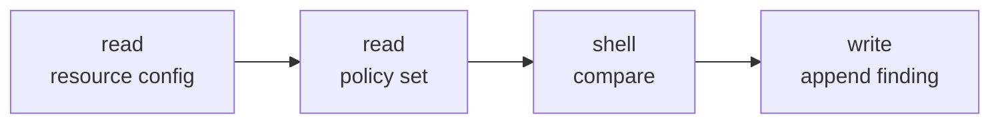
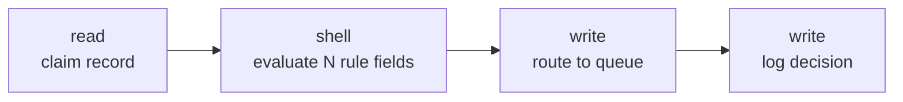
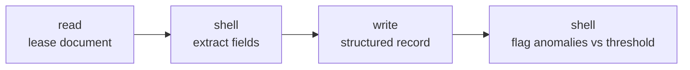
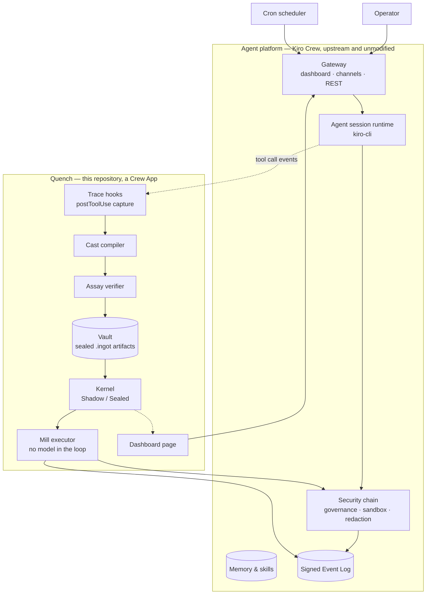
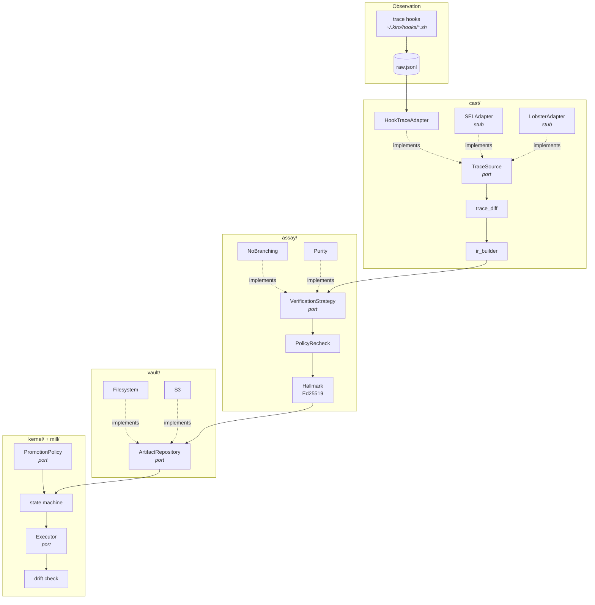
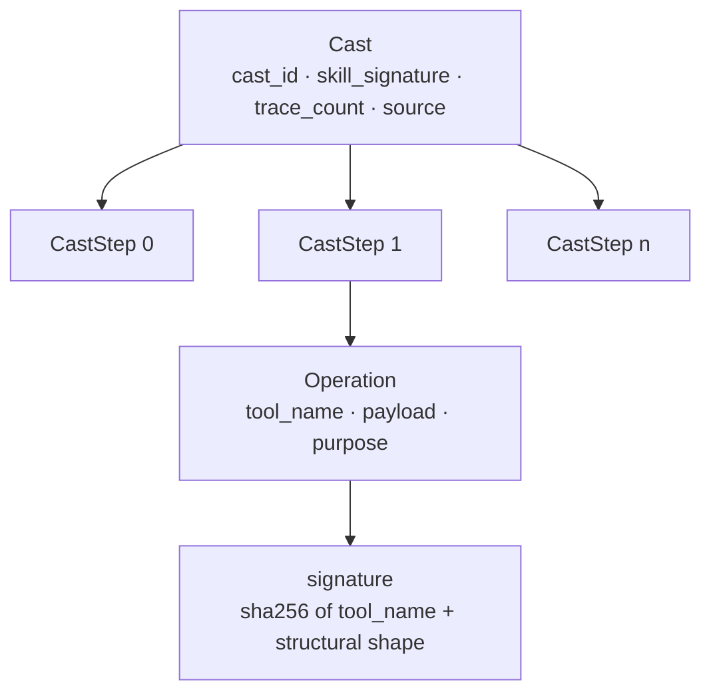
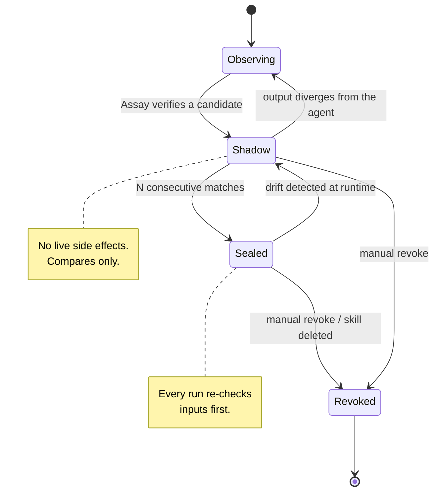
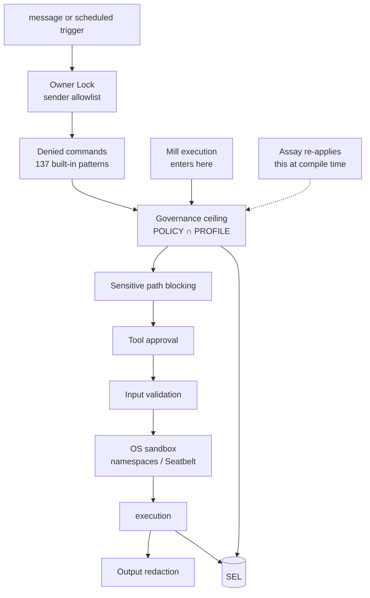
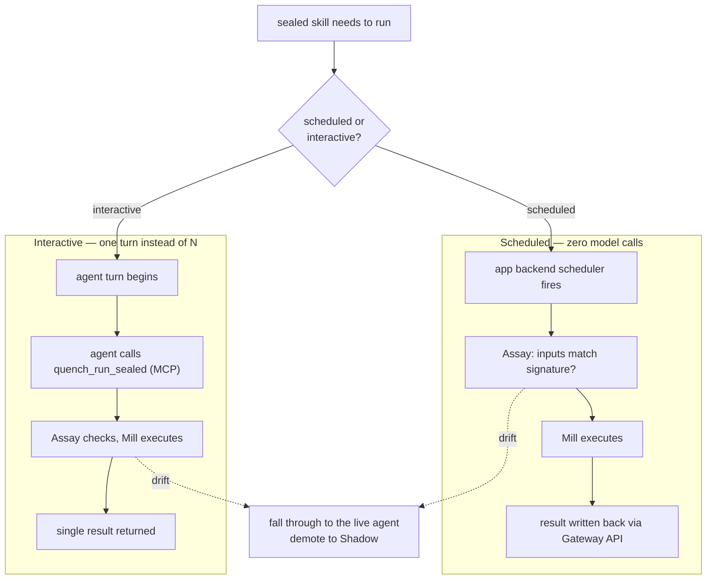

# Quench — Architecture Overview

**Status:** living document. Supersedes `brief-v1.2-frozen.md`.
**Last verified against:** Kiro Crew 0.5.0, kiro-cli 2.21.2, Ubuntu 24.04 — 2026-09-09.

> **How to read this.** The original brief was written before we had a running
> install. Four integration assumptions were tested against real software; three
> were false. This document reflects what is actually true. Where it diverges,
> [`../adr/0000-crew-seam-verification.md`](../adr/0000-crew-seam-verification.md)
> records why, with evidence.
>
> **VERIFIED** = confirmed empirically on a live install.
> **OPEN** = unresolved; do not build on it.
>
> Every section carries a worked example using the three agents defined in §2.
> Payloads shown as *captured* are real; payloads shown as *projected* are what
> we expect once the agent exists.

For the non-technical case, see [`../WHY-QUENCH.md`](../WHY-QUENCH.md).

---

## Contents

1. [What Quench is](#1-what-quench-is)
2. [The three example agents](#2-the-three-example-agents)
3. [System context](#3-system-context)
4. [Component architecture](#4-component-architecture)
5. [The Cast IR](#5-the-cast-ir)
6. [Data flow — observe to seal](#6-data-flow--observe-to-seal)
7. [Kernel state machine](#7-kernel-state-machine)
8. [Security model](#8-security-model)
9. [Execution paths](#9-execution-paths)
10. [Integration seams](#10-integration-seams)
11. [Repository layout](#11-repository-layout)
12. [Ports catalogue](#12-ports-catalogue)
13. [Build phases](#13-build-phases)
14. [Definition of done](#14-definition-of-done)
15. [Open questions](#15-open-questions)

---

## 1. What Quench is

A **determinism compiler for agent runtimes**. It observes execution traces,
proves a behaviour is repeatable, compiles it into a signed artifact, and executes
it without a model — falling back to the live agent the instant the world stops
matching what was sealed.

It is **not** a multi-agent framework and **not** an orchestrator. It operates on
one behaviour at a time, one layer below orchestration, and never decides which
agent runs or in what order. The mental model is a JIT compiler: the host platform
is the interpreter loop; Quench promotes hot, verified paths out of it.

> ### Worked example — what this means for one agent
>
> `cloud-governance-check` runs hourly. Today, each run costs **~6 model calls**:
> the agent reads the skill, decides to fetch a config, reads the result, decides
> to load the policy, compares, decides to log. 720 runs a month, **~4,320 model
> calls**, for a decision whose execution trace has not varied once.
>
> After Quench seals it: **0 model calls.** The same four operations run, in the
> same sandbox, under the same governance policy, writing the same audit record —
> without asking a model to re-derive a sequence it has produced identically 720
> times.

---

## 2. The three example agents

These are **fixtures, not features**. They exist to force every claim in this
document to survive contact with a real workflow. All three use synthetic data;
no client data ever enters this repository.

They live in `showcase/` and contribute **zero lines** to the kernel.

### 2.1 `cloud-governance-check` — the spine example

The simplest, and the first to be sealed. **Scheduled**, which matters: it is the
execution path where zero-model-call operation is achievable today (§9).



| | |
|---|---|
| Domain | Cloud governance |
| Trigger | Cron, hourly |
| Steps | 4 operations, linear, no branching |
| Why it's a real test | Runs on a schedule in production. The strongest possible case for *"why pay a model to do this the 200th time?"* |

### 2.2 `claims-triage` — looks like judgment, isn't



| | |
|---|---|
| Domain | Insurance / fintech flavoured |
| Trigger | Interactive or batch |
| Steps | 4 operations |
| Why it's a real test | Everyone *assumes* this needs judgment every time. Once the rules stabilise it is entirely deterministic. **This is the exact case Quench exists for** — work that quietly stopped being judgment-heavy and nobody noticed. |

### 2.3 `lease-abstraction` — multi-tool, and the Saga candidate



| | |
|---|---|
| Domain | Commercial real estate flavoured |
| Trigger | Interactive |
| Steps | 4 operations across 3 distinct tool types |
| Why it's a real test | First workflow where the extract step and the anomaly-flag step are naturally **separate ingots** — the first genuine Saga composition. |

---

## 3. System context



**Read this as a boundary statement.** Nothing in the Quench box modifies the
host. Every crossing is a documented extension point or a read-only consumer.
Note that **Mill's output re-enters the host security chain** — that arrow is the
most important one on the diagram.

> ### Worked example — one hourly governance run, before sealing
>
> 1. Cron fires → Gateway dispatches a turn to the agent session.
> 2. Agent reasons, calls `read` on the bucket config. **Model call 1–2.**
> 3. The call passes through governance → sandbox → executes → redaction → SEL.
> 4. The `postToolUse` hook fires; Quench appends the full payload to `raw.jsonl`.
>    **The agent is unaffected and unaware.**
> 5. Steps 2–4 repeat for the policy read, the comparison, the write.
> 6. Quench now holds one complete trace, keyed by `session_id`.
>
> Nothing has been compiled. Nothing has been trusted. Quench has only watched.

---

## 4. Component architecture



Concrete adapters are wired in exactly one place — `app/backend/main.py`, the
composition root. A new contributor reads that single file and sees the whole
object graph.

> ### Worked example — which component touches `claims-triage`, and when
>
> | Component | What it does to this skill | When |
> |---|---|---|
> | `HookTraceAdapter` | Groups 4 tool calls into a `Trace` keyed by session | Every run |
> | `trace_diff` | Compares 5 traces; confirms same shape, different claim IDs | On demand |
> | `ir_builder` | Emits a 4-step `Cast` | Once traces converge |
> | `NoBranchingStrategy` | Confirms no divergent control flow | At seal time |
> | `PurityStrategy` | Confirms no step returns timestamps or UUIDs | At seal time |
> | `PolicyRecheck` | Confirms every step passes `POLICY ∩ PROFILE` | At seal time |
> | `Hallmark` | Ed25519-signs; records "verified against 5 traces, 2026-09-20" | Once |
> | `FilesystemRepository` | Writes `~/.kiro/crew/ingots/<id>.ingot` | Once |
> | `Kernel` | Registers in Shadow; counts matches; promotes | Ongoing |
> | `Mill` | Executes the sealed Cast | Every run, once sealed |
>
> **Not one of these components knows what an insurance claim is.** That is the
> rule that keeps Quench a kernel — see `CONTRIBUTING.md`.

---

## 5. The Cast IR

### Structure



### The critical decision: a step is an operation, not a tool call — **VERIFIED**

Kiro batches several operations into one tool call. This payload is *captured*,
not illustrative:

```json
{
  "tool_name": "read",
  "tool_input": {
    "__tool_use_purpose": "Read quench-test.txt and list workspace directory",
    "operations": [
      {"mode": "Line",      "path": ".../quench-test.txt"},
      {"mode": "Directory", "path": "...", "depth": 1, "exclude_patterns": []}
    ]
  }
}
```

One call, two units of work. Modelling a step as a *tool call* would let two
genuinely different workflows compile to the same node whenever they batched
alike. **Step granularity is the operation.**

### Structural signatures

A Cast must serve runs whose inputs differ in content but not in form:

```
run 1:  {"path": "/configs/bucket-a.json", "depth": 1}
run 2:  {"path": "/configs/bucket-b.json", "depth": 1}
                        ↓  structural_signature()
        {"path": "str", "depth": "int"}        ← identical, so they converge
```

This signature is what Assay compares live inputs against before authorising
Mill. A new field, a changed type, different nesting — any of these is drift.

> ### Worked example — the compiled Cast for `cloud-governance-check`
>
> *Projected output once the agent exists:*
>
> ```
> $ quench cast cloud-governance-check
> Cast 7f3a9c21b40e8d15  (4 steps, 12 traces)
>     0  read     Read bucket encryption configuration
>     1  read     Load encryption policy definitions
>     2  shell    Compare config against policy
>     3  write    Append compliance finding to log
> ```
>
> And the step-0 signature, which is what drift is measured against:
>
> ```json
> {
>   "index": 0,
>   "operation": {
>     "tool_name": "read",
>     "payload_shape": {"mode": "str", "path": "str"},
>     "purpose": "Read bucket encryption configuration"
>   },
>   "signature": "a41d…"
> }
> ```
>
> Notice `__tool_use_purpose` becoming the human-readable label. That is what
> makes `quench inspect` answerable in English rather than JSON — the agent
> documented its own workflow for us, for free.

---

## 6. Data flow — observe to seal

```mermaid
sequenceDiagram
    autonumber
    participant Agent
    participant Hook as postToolUse hook
    participant Cast
    participant Assay
    participant Hallmark
    participant Vault
    participant Kernel

    loop every tool call, every run
        Agent->>Hook: tool_name, tool_input, tool_response, session_id
        Hook->>Hook: append to raw.jsonl (always exit 0)
    end

    Cast->>Cast: group by session_id
    Cast->>Cast: split batched calls into operations
    Cast->>Cast: diff N traces

    alt traces converge
        Cast->>Assay: candidate Cast
        Assay->>Assay: no branching?
        Assay->>Assay: outputs pure?
        Assay->>Assay: every step passes POLICY ∩ PROFILE?
        alt all pass
            Assay->>Hallmark: verified
            Hallmark->>Vault: signed .ingot + provenance
            Vault->>Kernel: register in Shadow Mode
        else any fail
            Assay-->>Cast: rejected, keep observing
        end
    else traces diverge
        Cast-->>Cast: "step 3 diverges; needs 2 more clean runs"
    end
```

**The observer must never be fragile.** The hook always exits 0 — a non-zero exit
from a `preToolUse` hook blocks the tool call outright. A malformed line is
skipped, not fatal. Quench failing must never break the agent it watches.

> ### Worked example — a rejection that is actually useful
>
> `lease-abstraction` after three runs. *Verified behaviour of the shipped CLI:*
>
> ```
> $ quench cast lease-abstraction
> Not a candidate: needs 5 clean traces to form a candidate, has 3;
> 2 more required
> ```
>
> And after a fourth run where the agent took an extra step on a malformed lease:
>
> ```
> Not a candidate: step count diverges (4 vs 5); the workflow branches
> and cannot be sealed in v1
> ```
>
> Both messages are phrased so an agent or a human can act on them directly.
> Never "verification failed" — always what is missing, and what to do. A
> rejection means *keep observing*, never *something broke*.

---

## 7. Kernel state machine



Thresholds are **not** hardcoded. `PromotionPolicy` is a Strategy port — a
CI-migration skill and a credential-rotation skill must not share a risk
tolerance.

> ### Worked example — `cloud-governance-check` through four weeks
>
> | Week | State | What happens | Model calls/run |
> |---|---|---|---|
> | 1 | `Observing` | 168 hourly runs recorded. Nothing compiled. | 6 |
> | 2 | `Observing` → `Shadow` | Traces converge; Assay verifies; Hallmark signs | 6 |
> | 3 | `Shadow` | Mill runs in parallel, side effects **discarded**, outputs compared. 47 consecutive matches. | 6 |
> | 4 | `Sealed` | Mill answers. Agent bypassed. | **0** |
>
> Then, week 6 — someone adds a `kms_key_id` field to the config:
>
> ```
> drift: step 0 input signature mismatch
>        sealed:  {"mode":"str","path":"str"}
>        live:    {"mode":"str","path":"str","kms_key_id":"str"}
> → falling through to the live agent
> → demoted to Shadow Mode, confidence reset to 0
> ```
>
> The run still succeeds — the agent handles it. Savings pause for this skill
> until it re-earns confidence against the new shape. **A wrong answer is never
> returned.** That is what "sealing is a cache, not a promise" means in practice.

---

## 8. Security model



**The design rule:** Mill is a shortcut around the *model call*, never around the
policy check.

**The test:** if a reviewer cannot tell from the audit log alone that a step ran
through Mill rather than the model — except for one clearly labelled field — the
security model is implemented correctly.

> ### Worked example — a Cast rejected at compile time
>
> Suppose `cloud-governance-check` is asked to also read credentials, and the
> agent complies during a run:
>
> ```
> $ quench verify 7f3a9c21b40e8d15
> REJECTED at step 2
>   operation:  read  {"path": "~/.aws/credentials"}
>   reason:     sensitive path blocked by governance ceiling
>   source:     ~/.kiro/crew/security_policy.json
>
> This Cast will not be signed. A step the platform would deny at runtime
> is denied here, at compile time.
> ```
>
> This is the difference between Quench and a caching layer. A cache would happily
> store the result. Assay refuses to *create the artifact at all*, so there is
> never a signed object encoding a forbidden action.
>
> ### Worked example — what the audit log shows after sealing
>
> ```
> {"event_type":"tool_invocation","agent":"cloud-governance-check",
>  "operation":"read","tool_kind":"fs_read","outcome":"allowed",
>  "executor":"mill","hallmark":"ed25519:9c4f…","prev_hash":"…"}
> ```
>
> Identical in coverage to an agent-driven run. Distinguishable only by
> `executor` and `hallmark`. That is the guarantee.

### Platform constraint — **VERIFIED**

The OS sandbox is Linux user namespaces or macOS Seatbelt. **It does not exist on
Windows**, and Crew rejects every Windows hook path outright — autoimport silently
loads nothing. Quench therefore requires Linux or macOS. See
[`../adr/0005-linux-required-for-sandbox-parity.md`](../adr/0005-linux-required-for-sandbox-parity.md).

---

## 9. Execution paths

The original brief assumed one Sealed Mode: a pre-dispatch hook intercepts a turn
and answers in its place. **That is not available** — the host's own architecture
notes state apps "cannot intervene in core flows" and the hook manager "exposes no
registration path."

Sealed Mode therefore splits by workflow type.



> ### Worked example — the same three agents, different paths
>
> | Agent | Path | Before | After | Why |
> |---|---|---|---|---|
> | `cloud-governance-check` | **Scheduled** | 6 calls/run | **0** | Cron-triggered; our backend invokes Mill directly, no agent turn exists to intercept |
> | `claims-triage` | **Interactive** | 6 calls/run | **1** | A user triggers it; the turn must happen, but 4 tool round-trips collapse into one `quench_run_sealed` call |
> | `lease-abstraction` | **Interactive → Saga** | 6 calls/run | **1** | Same, and later composes two ingots under one Saga |
>
> This is why `cloud-governance-check` is the Phase 8 proof: it is the one domain
> where zero-model-call operation is achievable through documented seams today.
> Closing the gap upstream — opening the host's hook manager to app registration —
> would move the other two to zero as well, and is on the roadmap.

---

## 10. Integration seams

All **VERIFIED** against a live install.

### Trace capture

```
agent.kiro_hooks             explicit entries in ~/.kiro/crew/config.json, merged additively
agent.kiro_hooks_autoimport  default TRUE — scans the hooks directory
agent.kiro_hooks_dir         default ~/.kiro/hooks — executable scripts
```

Event resolution: an explicit `# event:` header wins, else the filename suffix
(`-post.sh` → `postToolUse`, `-pre.sh`, `-prompt.sh`), else `preToolUse`. An
optional `# matcher:` header filters by tool.

**`~/.kiro/agents/kirocrew.json` is regenerated on every gateway start.** Hand
edits are silently wiped — observed within 90 seconds. Quench installs scripts
into the autoimport directory and never touches a file the host owns.

Hook commands are validated: absolute path, no shell metacharacters, must exist,
inside `$HOME`, not a sensitive path. Rejections are audited to the SEL as
`kiro_hooks_rejected` — visible, not silent.

> ### Worked example — the actual installed hook
>
> ```bash
> #!/bin/bash
> # event: postToolUse
> # Quench trace capture. Installed by scripts/install_hooks.sh - do not edit.
> # MUST always exit 0: a nonzero preToolUse exit blocks the tool call.
> OUT="/home/<user>/.kiro/quench-traces/raw.jsonl"
> mkdir -p "$(dirname "$OUT")"
> cat >> "$OUT" 2>/dev/null
> printf '\n' >> "$OUT" 2>/dev/null
> exit 0
> ```
>
> Seven lines. That is the entire instrumentation footprint — installed by
> `scripts/install_hooks.sh`, into a directory the host is designed to scan.

### Payload shapes — **VERIFIED**

| Event | Keys on stdin |
|---|---|
| `userPromptSubmit` | `hook_event_name`, `cwd`, `session_id`, `prompt` |
| `preToolUse` | + `tool_name`, `tool_input` |
| `postToolUse` | + `tool_response` |

`userPromptSubmit.prompt` carries the **entire agent system prompt**, not just the
user's text — signature matching there must extract the user turn.

### Why not the Signed Event Log

Event types are `tool_invocation`, `tool_approval`, `tool_denial`, `mcp_call`,
`api_access`. **Tool arguments are truncated to 500 bytes and results are not
recorded at all.** Sufficient for auditing; insufficient for compiling. The SEL
adapter remains as a stub demonstrating the port generalises.

### App manifest

`permissions.api` is the one permission enforced today — deny-by-default on
out-of-scope paths. Omitting it denies every Gateway call. `apps_allow_third_party`
defaults to **false**, so enabling Quench is a required install step.

---

## 11. Repository layout

```
quench/
├── app.json                      Crew App manifest
├── README.md · CONTRIBUTING.md · SECURITY.md · LICENSE
│
├── docs/
│   ├── WHY-QUENCH.md             the product case, presentation source
│   ├── SETUP.md                  tested fresh-machine runbook
│   ├── architecture/
│   │   ├── overview.md           this document
│   │   ├── brief-v1.2-frozen.md  the original brief, preserved
│   │   └── diagrams/             .mmd sources
│   └── adr/                      immutable decision records
│
├── cast/        TraceSource, trace diffing, IR construction
├── assay/       verification strategies, governance recheck, Hallmark
├── vault/       artifact repository
├── mill/        executor, drift detection, sandbox adapter
├── kernel/      Shadow/Sealed state machine, promotion policy
├── saga/        multi-ingot composition
├── pack/        .ingotpack bundles
├── exchange/    registry client
│
├── app/         Crew App glue — backend, agents, skills, UI
├── showcase/    the three agents from §2 — fixtures, not features
│   ├── cloud-governance-check/
│   ├── claims-triage/
│   └── lease-abstraction/
├── deploy/      docker-compose, proxy, seeding
├── scripts/     setup.sh, install_hooks.sh, build_all.sh, measure_savings.py
└── tests/       cross-component integration
```

`app/` is deliberately thin — not where logic lives, where logic gets wired up. If
the host's App Kit changes, the blast radius is `app/backend/`.

---

## 12. Ports catalogue

| Port | Component | Contract | Adapters |
|---|---|---|---|
| `TraceSource` | cast | `fetch_traces(skill_id) -> list[Trace]` | **HookTraceAdapter** (v1), SEL (stub), Lobster (stub) |
| `IRSink` | cast | `emit(cast) -> None` | — |
| `VerificationStrategy` | assay | `verify(cast, traces) -> VerificationResult` | NoBranching, **Purity** |
| `ArtifactRepository` | vault | `put/get/list/revoke` | Filesystem, S3 |
| `PromotionPolicy` | kernel | `should_promote / should_demote` | default, conservative |
| `Executor` | mill | `execute / drift_check` | Python (v1), Rust (later) |
| `GraphExecutor` | saga | `run(dag) -> SagaResult` | — |
| `RegistryClient` | exchange | `publish/pull/search` | local, http |

`TraceSource` is deliberately the narrowest port in the system. It asks only for
*tool name, input, output, grouped by session* — a shape Kiro CLI, Claude Code and
OpenClaw all emit. **This port is why Quench is a determinism compiler rather than
a Kiro Crew plugin.**

> ### Worked example — swapping a policy without touching the kernel
>
> `cloud-governance-check` touches no credentials; `claims-triage` writes to a
> queue that affects real payouts. They should not share a promotion threshold:
>
> ```python
> # app/backend/main.py — the ONLY place adapters are wired
> kernel.register("cloud-governance-check", policy=DefaultPolicy(n=10))
> kernel.register("claims-triage",          policy=ConservativePolicy(n=50))
> ```
>
> Two lines in the composition root. No change to `kernel/`, no change to the
> Cast IR, no domain logic anywhere near the compiler.

---

## 13. Build phases

Every phase gated on the previous producing a real, measured result.

| Phase | Scope | Exit criteria | State |
|---|---|---|---|
| **0** | Environment, seam verification | Live install; four assumptions tested | ✅ done |
| **1** | Scaffold | Full tree, ports typed, `setup.sh` works | ✅ done |
| **2** | Trace capture | Hooks deliver full payloads | ✅ done |
| **3** | Cast compiler | A Cast compiles from real traces | ✅ done |
| **4** | Measurement source | Real model-call baseline captured | ⛔ **blocked** |
| **5** | `cloud-governance-check` | Runs repeatedly, accumulates history | ⬜ next |
| **6** | Assay + Hallmark + Vault | A signed `.ingot` on disk | ⬜ |
| **7** | Shadow Mode | Confidence accumulating from real matches | ⬜ |
| **8** | Sealed Mode | Zero-model-call run, `executor: mill` in the SEL | ⬜ |
| **9** | Drift test | Deliberate drift falls back and demotes | ⬜ |
| **10** | Domains 2 and 3 | All three reach Sealed independently | ⬜ |
| **11** | Saga + Pack | One task across two sealed ingots | ⬜ |
| **12** | Deploy | Link-shared dashboard, real numbers | ⬜ |
| **13** | Upstream + registry PRs | Hook-manager seam; app-registry entry | ⬜ |
| **14** | Portability | One Cast compiled from a non-Crew source | ⬜ |

**Phase 4 blocks everything downstream.** The SEL has no model-call or token event
type, so the number §14 depends on has no source. A baseline cannot be
reconstructed after sealing begins.

---

## 14. Definition of done

v1 is done when every line is true — not when the architecture is complete.

- [ ] `cloud-governance-check` has sealed from real repeated runs and executed at
      least once in Sealed Mode with zero model calls, logged `executor: mill`.
- [ ] `claims-triage` and `lease-abstraction` have independently done the same.
- [ ] `measure_savings.py` produces a **real** before/after model-call count.
- [ ] At least one drift event triggered deliberately and confirmed to fall back,
      with the demotion visible on the dashboard.
- [ ] At least one Saga chaining two sealed ingots has executed.
- [ ] `deploy/` is live, seeded, reachable via an authenticated link.
- [ ] A write-up citing measured numbers — not "could save tokens", but "saved X%
      of model calls on Y over Z runs".
- [ ] A PR against the host's app registry opened, whatever its outcome.

Out of scope for v1: branching Casts, a public Exchange, cross-skill learning, and
anything that would let Mill execute a step the host's governance would deny.

---

## 15. Open questions

**OPEN — blocks Phase 4.** No model-call or token source identified. The SEL does
not record one. Candidates: session transcripts, `chat_done` event accounting.
Must be resolved and a baseline banked before anything seals.

**OPEN.** Whether `userPromptSubmit` can supply a response replacing the turn, or
only block. Determines whether interactive Sealed Mode can reach zero model calls
without an upstream change. Cheap to test.

**OPEN.** Whether the OS sandbox genuinely engages on the public edition.
`config.json` shows `agent.sandbox: auto` as distinct from `agent.jail: auto` (the
public edition has no jail backend), which is encouraging, but confirmation is
pending. §8's guarantee depends on it.

**OPEN.** Matcher semantics. Crew's shipped hook declares `matcher: "execute_bash"`
yet fired on `tool_name: "shell"`. Quench omits the matcher deliberately; semantics
must be pinned before relying on it.
